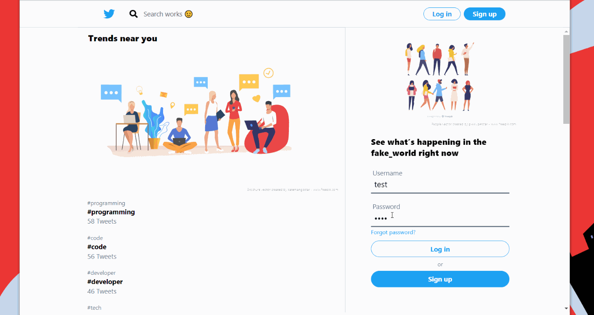

## React front-end for tclone
Try it [here](https://tclone.netlify.app)
back-end repo [here](https://github.com/muzam1l/tclone-api)

> *looks exactly like twitter web app* 😊

It is my own take on building Twitter clone, I have tried to keep things simple and concise. With minimal modules needed, it is very lightweight and fast, yet very functional and feature-rich and improving consistently.

## Things working ⚡

- __State management__ (UPDATED to use redux-toolkit)
Although not in my first builds, where i had state mostly in components itself, now most of the state is global in redux store. Posts, Users etc are in normalised form (by `createAdapter`) and accessed using selectors and using CRUD methods (by adapter) thus sticking solely to ducks file pattern and redux-toolkit environment. This change combined with adding bootstarp has allowed me quickly add new features and made whole app very stable and functional, like spinners which used to be all around the place have been reduced heavily and app now feels more fluid. Now basic things, like user/user_timeline which were missing are added, I will continue to improve it, like adding notifications and socket api is now definitely on agenda.

- __Styling__ (UPDATED! to use bootstrap)
First step towards learning from my mistakes and improving this mess, i removed all of my custom css (courage 😎), and replaced it with bootstrap classes, now DOM and directories are both clean and more portable, accessibility should improve and extensibilty would now be easier . Bootstrap is customised to match twitter/tclone theme mostly with overriding Sass variables and also extending classes and adding my own ones too. Though all of the styling and responsive layout is now bootstrap powered, i have reatined react-responsive Media queries to not load the hidden components at all. This change lays the strong base to entend this project beyond!.

- __Compose posts__ (minimal for now)
Though I am considering implementing modal and media sharing in posts (Tweets). Right now, it is very concise and only lets you to share text-based posts only. But tweets are parsed for hashtags, so you may be able to make a hashtag through trends.

- __Pre populated posts__ (only original feature of this project 💪).
when you open [tclone](https://tclone.netlify.app/), you see a bunch of users and their tweets (after you follow them). These are actual recent tweets of these accounts on Twitter and fetched via twitter api and then populated in database (so no, NASA didn't log into this clone 💣). Tweet Model on this project is exactly compatible with Tweet objects returned by Twitter api so you can pre populate  you own set of tweets (parsed automatically) for your own fork of this project (Go make one...----------------------------------------------------------------    please🥺).

- __Trends and User suggestions__ (*It ain't much but it's honest work*)
Hashtags with higher posts are stored as trends on the sidebar or on explore page and you can click on them to search for posts with given hashtags, users you are not following are also listed in Who to follow card on sidebar. Trends are now realtime, so go on rise your hastag to trending section 💥.

- __Search__ (it is easily done through mongoDB queries but I was proud to have it 🥇)
You can search for text that the posts contain or for hashtags (by prefixing search with #) and for users and user mentions (by prefixing query with @) and all of this just works and is enough to search through all of database 🥳)

-  __Authentication__ (simple one 💩)
Authentication is done with passport local-strategy with sessions managed [server](https://github.com/muzam1l/tclone-api) side via cookies (though I need some help regarding prevention of session-hijacking). No session data is stored in local-storage and cookies are also httpOnly. Log-in session is detected in React, at app start, by sending and checking get request to authenticating api, and subsequent api requests also check for `403`, to destroy session, as an added measure. Authentication state is stored now in redux store as opposed to context api previously.

## TODO
All those things which I want to do and makes me learn smarting new and ........ lets see what I can do 🤷‍♂️.
Some of it would be 
- [x] Adding react-bootstrap for styling
- [x] Adding Redux-toolkit for global state and utilities 
- [ ] Likes, commets on post and maybe include retweets now. 
- [ ] Using Modals and popovers' for things like compose posts and hover on say user-link for detail (like twitter😉).
- [ ] Notifications and improving engagement, this include general fixed and features and maybe socket-api (lying useless in dependencies for ages now😁).
- [ ] Dark mode, not particularly excited about but will be fun messing with bootstraps sass variables ans mixins.
- [ ] Custom/Cool/New features that even twitter would want to borrow 😎. but for this community participation would be required.

## Contributing
This is my favorite part. Just do it...💥
There are no guidelines for code or whatsoever and I never write tests (because I can't 😁).
So just bombard me with pull requests 🥺.

## Footnote
If you are still reading up to this point, there is no special Treat for you, but I will say **Thank you**.
